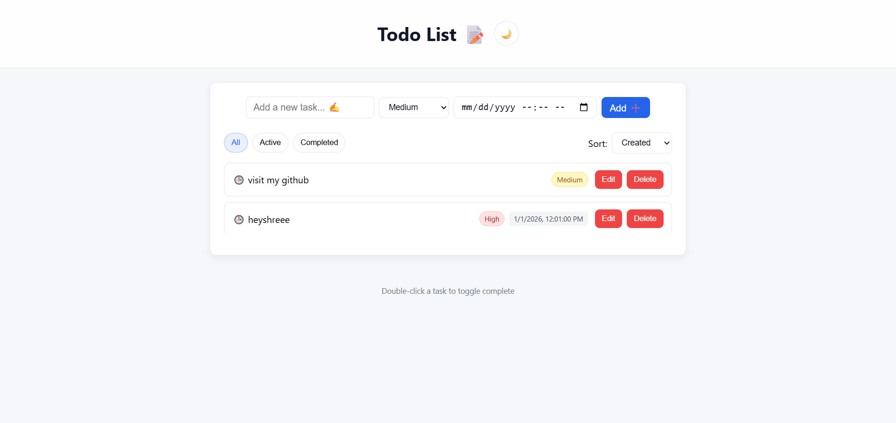

# 📝 Todo List App

A modern, responsive todo application built with React (Create React App). It focuses on fast inline interactions, accessibility, and persistence with localStorage.

**🔗 Live Demo:** https://todolistapp-001.netlify.app/



---

## ✨ Features
- **Add / Edit / Delete / Complete** tasks inline (no popups) ➕ ✏️ 🗑️ ✅
- **Task priority** with color-coded badges: High, Medium, Low 🔴 🟡 🟢
- **Due date** with browser notifications when tasks become due ⏰ 🔔
- **Filters & Sort**: All / Active / Completed and sort by Created, Due date, or Priority 🔎 ↕️
- **Persistent storage** in `localStorage` (tasks and theme) 💾
- **Light/Dark theme** toggle (persists) ☀️🌙
- **Responsive layout** for mobile and desktop 📱🖥️
- **Subtle animations** for item enter/remove and hover states ✨
- **Keyboard shortcuts** ⌨️
  - Enter: add task or save edit
  - Esc: cancel edit
  - Double‑click task text: toggle complete

---

## 🚀 Getting Started

### 🧰 Prerequisites
- Node.js 16+ and npm

### ▶️ Install and run
```bash
npm install
npm start
```
The app runs at http://localhost:3000 by default.

### 🏗️ Build for production
```bash
npm run build
```

---

## 📁 Project Structure
- `public/`
  - `index.html` – CRA entry HTML
  - `screenshot.png` – app screenshot used in this README
- `src/`
  - `index.js` – React entry
  - `App.js` – main app component and logic
  - `App.css` – global styles, themes, responsive rules, animations
  - Other CRA defaults: tests, web vitals, etc.

---

## ⚙️ Configuration & Customization
- **Theme colors**: tweak CSS variables in `src/App.css` under `body` and `body.dark` (`--primary`, `--border`, etc.)
- **Control sizes**: adjust `--control-h` (control height) in `src/App.css`
- **Notifications**: the browser may block notifications until permission is granted; permission is requested on first load
- **Storage**: tasks and theme are saved to `localStorage` under keys `todos` and `theme`

---

## 🩺 Troubleshooting
- If notifications do not appear, check the site permission in your browser settings and ensure the tab is active or allowed to show notifications.
- If the dev server fails to start on port 3000, set `PORT=3001` (Windows PowerShell: `$env:PORT=3001; npm start`).
- If styles look off after edits, clear the browser cache or do a hard refresh.

---

## 📄 License
This project is provided as-is for learning and personal use. Add your preferred license text here.
